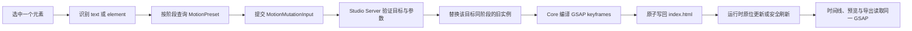

# Video Studio 语义动画架构

## 元数据

- **版本**：1.0
- **状态**：已实现
- **范围**：Video Studio / HyperFrames
- **最后更新**：2026-08-10

## 目标

新动画把普通用户、AI 和底层播放引擎分成清晰的三层：

```text
用户选择元素并表达意图
→ 选择“出现 / 动作 / 消失”和语义预设
→ 产品验证并编译为确定性的 GSAP 时间线
→ HyperFrames 负责预览、逐帧 seek 和导出
```

用户不需要理解 `to`、`from`、`fromTo`、GSAP 属性名或时间线实现。GSAP 仍是运行和渲染底座，但不再是普通动画的产品合约。

这套架构只覆盖 Video Studio。它不会建立 Design、PPT 和 Video 共用的动画协议，也不增加动画引擎、数据库、依赖或独立动画文件。

## 用户模型

选中单个元素后，右侧动画区统一为：

```text
出现 | 动作 | 消失
```

- 叶子文字节点使用文字预设；包含真实子元素的文字容器按普通元素处理，避免破坏排版。
- 图片、视频、SVG、图标、形状和容器使用通用元素预设。
- 同一目标的每个阶段最多存在一个预设；选择其他效果会替换当前阶段，其他阶段不受影响。
- 公共编辑项保持轻量：效果、时长、速度和预览。方向、强度、文字拆分、颜色等仅在预设声明后出现。
- “动作”表示动画结束后回到元素原始设计状态，适合吸引注意，不改变最终布局。
- 旧 GSAP 动画继续播放、保存和导出，但普通检查器不再展示旧版技术编辑入口。

## 唯一合约

类型、注册表、参数验证和编译入口由 `@hyperframes/core/motion-presets` 统一拥有。

```ts
type MotionPhase = "enter" | "emphasis" | "exit";
type MotionTargetKind = "text" | "element";

interface MotionPreset {
  id: string;
  version: 1;
  label: string;
  phase: MotionPhase;
  targetKinds: MotionTargetKind[];
  parameterSchema: MotionParameter[];
  defaults: MotionParameters;
  semantics: {
    intents: string[];
    tones: string[];
    preferredFor: string[];
    avoidFor: string[];
  };
}

interface MotionInstance {
  id: string;
  presetId: string;
  target: StableElementLocator;
  targetKind: MotionTargetKind;
  phase: MotionPhase;
  start: number;
  duration: number;
  parameters: MotionParameters;
}
```

关键约束：

- `presetId` 是永久稳定的产品 ID，例如 `text.enter.rise`、`element.emphasis.lift`。
- 参数只能来自预设的 `parameterSchema`，未知、越界或类型错误的参数会被结构化拒绝。
- 预设只能使用可确定、可 seek 的有限关键帧；普通预设不得修改布局尺寸或文档定位结构。
- `MotionInstance.id` 由目标选择器和阶段稳定生成，用于精确替换运行时动画，不依赖动画在时间线中的顺序。
- `semantics` 是 UI 搜索和 AI 选择效果的共同语义，不在 Prompt 中复制一份动画规则。

## 代码所有权

| 层 | 所有者 | 职责 |
|---|---|---|
| 共享路径 | `packages/types/src/hyperframes.ts` | 会话到 Video 项目、Studio 端口等稳定映射 |
| 动画核心 | `vendor/hyperframes/packages/core/src/motionPresets.ts` | 合约、查询、参数验证、实例创建与编译 |
| 预设目录 | `motionPresetCatalog.ts`、`motionPresetKeyframes.ts` | 语义元数据、默认参数和确定性关键帧 |
| GSAP 解析 | `vendor/hyperframes/packages/parsers` | 读取和回写语义动画附加数据，不丢失身份 |
| 写入服务 | `vendor/hyperframes/packages/studio-server/src/routes/files.ts` | 验证目标、替换同阶段动画、文字拆分、原子保存 |
| Studio UI | `SemanticMotionPanel.tsx` 与现有 Property Panel | 目标分类、预设选择、参数控件、预览 |
| 运行时 | `gsapRuntimePatch.ts`、Player、NLE Preview | 无闪烁更新、保守回退和双缓冲刷新 |
| AI 入口 | `apps/server/src/opencode-plugins/ipollowork-extensions-preview.ts` | 会话锁定、预设查询和类型化变更工具 |

UI 和 AI 最终都调用 Studio Server 的 `mutate-motion` 写入路径；服务端验证器和 Core 注册表是硬性真相。

## 保存格式

语义动画仍保存在现有 `index.html` 的 GSAP 时间线中：

1. `compileMotionInstance` 把预设实例编译成 GSAP keyframes、位置、时长和缓动。
2. 编译结果在 GSAP `data` 字段中保存 `ipw-motion:v1:<MotionInstance JSON>`，解析器可在重载后恢复完整身份和参数。
3. 目标元素的 `data-ipw-animation-reference` 保存已应用的稳定 `presetId`，供模板、验证和其他产品能力识别。
4. 按词或按字动画只在需要时生成 `data-ipw-motion-word` / `data-ipw-motion-char` 包装；最后一个拆分动画删除后恢复原始纯文本。

没有 `studio-motion.json`，没有第二份浏览器状态，也没有数据库迁移。HTML 与其中的 GSAP 时间线继续是持久化真相。

## 变更链路



默认开始时间由元素自身的 `data-start` / `data-duration` 推导：出现位于开头，消失位于末尾，动作位于中间。替换预设时优先保留已有开始时间、时长以及新预设仍支持的参数。

## 无白屏运行时更新

写入成功后有两级更新策略：

1. **精确原位更新**：通过稳定的 `MotionInstance.id` 在 iframe 的实际 GSAP timeline 中定位动画，只重建目标 tween，并重新 seek 到当前播放点。不会使整个 timeline 失效，也不会重新捕获其他元素的运行时样式。
2. **双缓冲安全刷新**：当目标不能被唯一定位、关键帧结构不兼容或属于自定义动态表达式时，不冒险修改错误 tween。NLE Preview 在后台加载新的 Player，恢复播放点并确认 runtime ready 后再切换可见实例；旧画面在交接前持续显示。

这个边界同时解决了切换效果、插入组件或文件监听触发刷新时短暂显示白屏的问题。运行时补丁必须保守：无法证明安全就返回失败，由双缓冲刷新接管。

## AI 与语音

产品暴露两个类型化工具：

- `list_motion_presets`：按阶段、意图和气质返回精简预设。
- `mutate_motion`：对当前 Video 会话中一个稳定目标执行添加、替换、调参或删除。

工具根据当前 OpenCode 会话解析并锁定对应的 `video/<sessionId>` 项目，不能传入任意项目目录。语音转写只产生普通用户意图，之后走同一工具链，不存在语音专属动画协议。

当前 AI 工具先开放叶子文字目标；Studio UI 和底层合约已同时支持文字与普通元素。后续给 AI 开放普通元素时只扩展工具参数和目标解析，不新增协议或编译器。

预设无法表达的高级动画仍可使用自定义 GSAP，但它属于兼容/高级路径，不会伪装成语义预设。

## 扩展规则

新增一个普通动画时：

1. 在 `motionPresetCatalog.ts` 增加稳定 ID、目标类型、阶段、参数和语义。
2. 在 `motionPresetKeyframes.ts` 增加确定性关键帧。
3. 复用现有参数控件；只有出现新的参数类型时才扩展 UI primitive。
4. 增加 Core 编译测试、Studio Server 保存/重载测试和 UI 目标过滤测试。
5. 用真实 Video Studio 验证播放、暂停、seek、时间线、保存重载和导出一致。

禁止为单个预设增加独立状态文件、专属 API、专属面板或另一套运行引擎。复杂架构图、地图、粒子和 Three.js 场景属于以后可声明参数的高级组件/特效系统，不进入本普通动画注册表。

## 兼容性

- 已有 `to`、`from`、`fromTo`、`set` 和无法识别的自定义 GSAP 保持原样，并继续由解析、播放和渲染链路消费。
- 新 UI 不自动改写旧动画，也不要求旧项目迁移后才能打开。
- 语义预设只使用现有 GSAP / HyperFrames 能力，模板格式、Composition 结构和导出格式不变。
- 删除旧版普通用户入口与保留底层兼容是两件事：UI 可以简化，旧内容不能失效。

## 验证要求

合入前至少覆盖：

- Core：目录过滤、参数验证、实例编译和中英文语义查询。
- Parser：语义 `data` 和 `id` 解析/回写不丢失。
- Studio Server：文字与元素添加、同阶段替换、阶段独立、删除、非法目标和非法参数。
- Studio：目标分类、三阶段 UI、时长/速度/专属参数、预览、撤销/重做和时间线片段。
- Runtime：精确 tween 更新、保守回退、刷新期间不露出空白帧。
- AI：会话目录锁定，查询与变更只访问当前 Video 项目。
- 真实应用：运行 `evals/flows/video-semantic-element-motion.flow.mjs`，并以生成的 `fraimz.html` 全部通过为验收依据。
